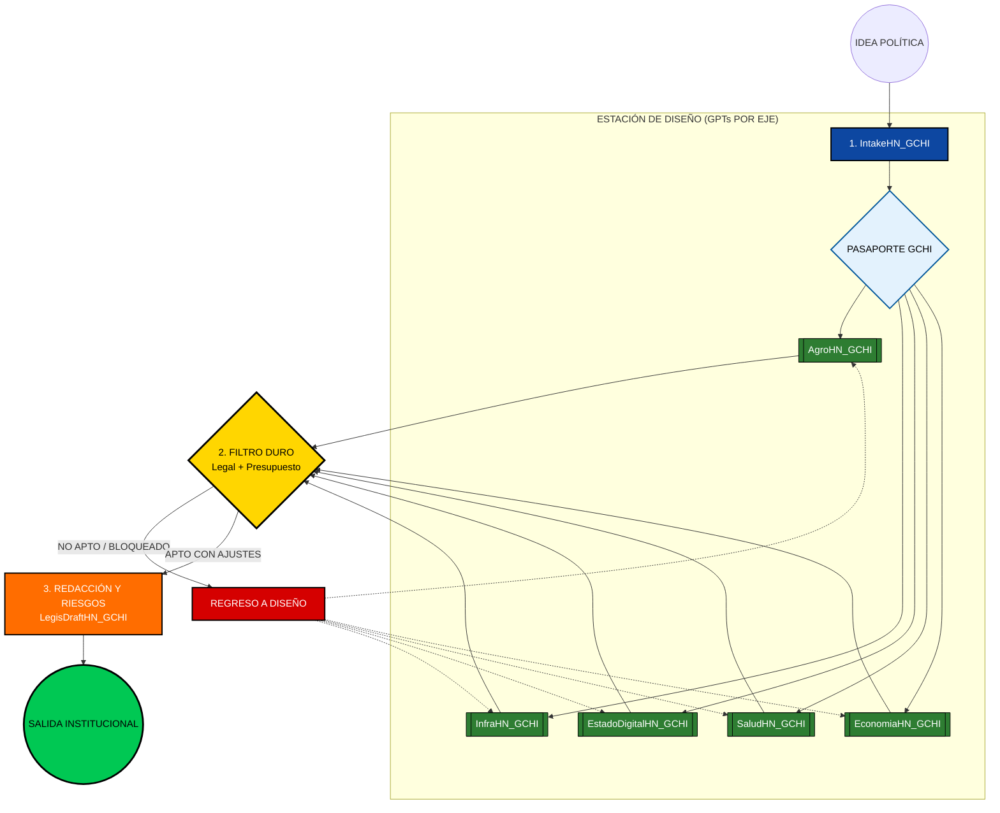

```mermaid
graph TD
    %% Inicio del Proceso
    A((IDEA POLÍTICA)) --> B[1. IntakeHN_GCHI]

    %% Bloque de Diseño con Ejes Diversificados
    subgraph "ESTACIÓN DE DISEÑO (GPTs POR EJE)"
        B --> C{PASAPORTE GCHI}
        C --> D1[[AgroHN_GCHI]]
        C --> D2[[InfraHN_GCHI]]
        C --> D3[[EstadoDigitalHN_GCHI]]
        C --> D4[[SaludHN_GCHI]]
        C --> D5[[EconomiaHN_GCHI]]
    end

    %% Flujo de Validación con Alto Contraste
    D1 & D2 & D3 & D4 & D5 --> E{2. FILTRO DURO<br/>Legal + Presupuesto}

    %% Decisiones
    E -->|NO APTO / BLOQUEADO| F[REGRESO A DISEÑO]
    F -.-> D1 & D2 & D3 & D4 & D5
    
    E -->|APTO CON AJUSTES| G[3. REDACCIÓN Y RIESGOS<br/>LegisDraftHN_GCHI]
    
    %% Salida
    G --> H((SALIDA INSTITUCIONAL))

    %% Estilos de Alto Contraste
    style B fill:#0D47A1,stroke:#000,stroke-width:2px,color:#fff
    style C fill:#E3F2FD,stroke:#01579B,stroke-width:2px,color:#000
    style D1 fill:#2E7D32,stroke:#000,stroke-width:1px,color:#fff
    style D2 fill:#2E7D32,stroke:#000,stroke-width:1px,color:#fff
    style D3 fill:#2E7D32,stroke:#000,stroke-width:1px,color:#fff
    style D4 fill:#2E7D32,stroke:#000,stroke-width:1px,color:#fff
    style D5 fill:#2E7D32,stroke:#000,stroke-width:1px,color:#fff
    style E fill:#FFD600,stroke:#000,stroke-width:3px,color:#000
    style F fill:#D50000,stroke:#000,stroke-width:2px,color:#fff
    style G fill:#FF6D00,stroke:#000,stroke-width:2px,color:#fff
    style H fill:#00C853,stroke:#000,stroke-width:3px,color:#000
```
