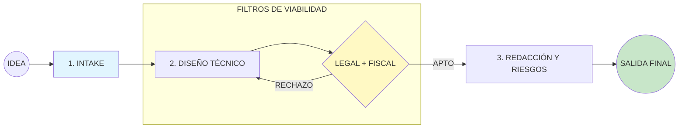

```mermaid
graph LR
    A((IDEA)) --> B[1. INTAKE]
    B --> C[2. DISEÑO TÉCNICO]
    
    subgraph "FILTROS DE VIABILIDAD"
    C --> D{LEGAL + FISCAL}
    end
    
    D -->|APTO| E[3. REDACCIÓN Y RIESGOS]
    D -->|RECHAZO| C
    
    E --> F((SALIDA FINAL))

    style B fill:#e1f5fe
    style D fill:#fff9c4
    style F fill:#c8e6c9
```
