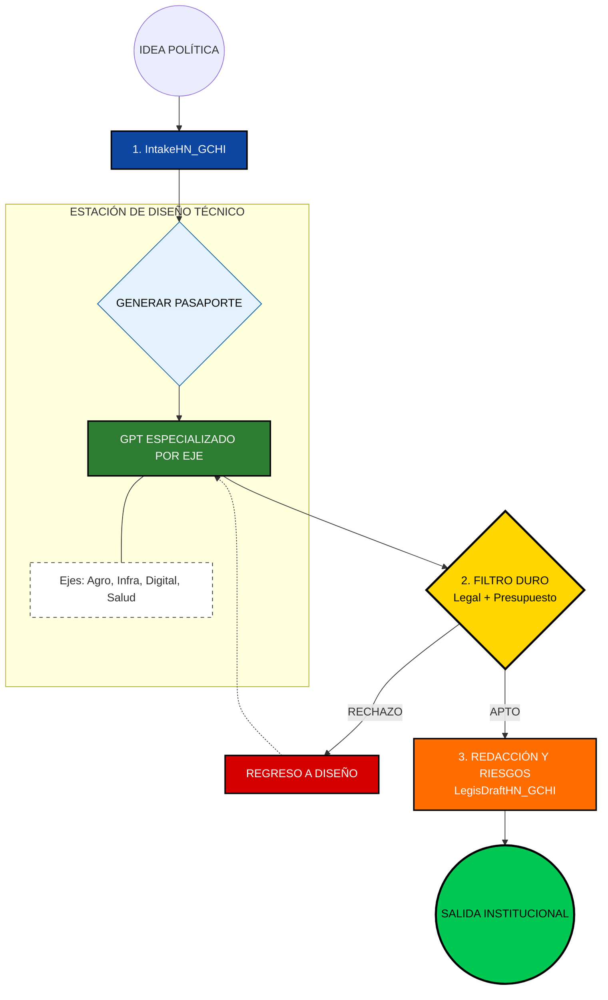

```mermaid
graph TD
    %% Inicio del Proceso
    A((IDEA POLÍTICA)) --> B[1. IntakeHN_GCHI]

    %% Nodo Selector unificado
    B --> C{GENERAR PASAPORTE}
    
    %% Representación de los Ejes corregida
    subgraph "ESTACIÓN DE DISEÑO TÉCNICO"
        C --> D[GPT ESPECIALIZADO POR EJE]
        D --- D_Note["Ejes: Agro, Infra, Digital, Salud"]
    end

    %% Flujo de Validación con Alto Contraste
    D --> E{2. FILTRO DURO<br/>Legal + Presupuesto}

    %% Decisiones y Ciclo
    E -->|RECHAZO| F[REGRESO A DISEÑO]
    F -.-> D
    
    E -->|APTO| G[3. REDACCIÓN Y RIESGOS<br/>LegisDraftHN_GCHI]
    
    %% Salida
    G --> H((SALIDA INSTITUCIONAL))

    %% Estilos de Alto Contraste (Accesibilidad)
    style B fill:#0D47A1,stroke:#000,stroke-width:2px,color:#fff
    style C fill:#E3F2FD,stroke:#01579B,stroke-width:1px,color:#000
    style D fill:#2E7D32,stroke:#000,stroke-width:2px,color:#fff
    style E fill:#FFD600,stroke:#000,stroke-width:3px,color:#000
    style F fill:#D50000,stroke:#000,stroke-width:2px,color:#fff
    style G fill:#FF6D00,stroke:#000,stroke-width:2px,color:#fff
    style H fill:#00C853,stroke:#000,stroke-width:3px,color:#000
    style D_Note fill:#fff,stroke:#333,stroke-dasharray: 5 5
```
